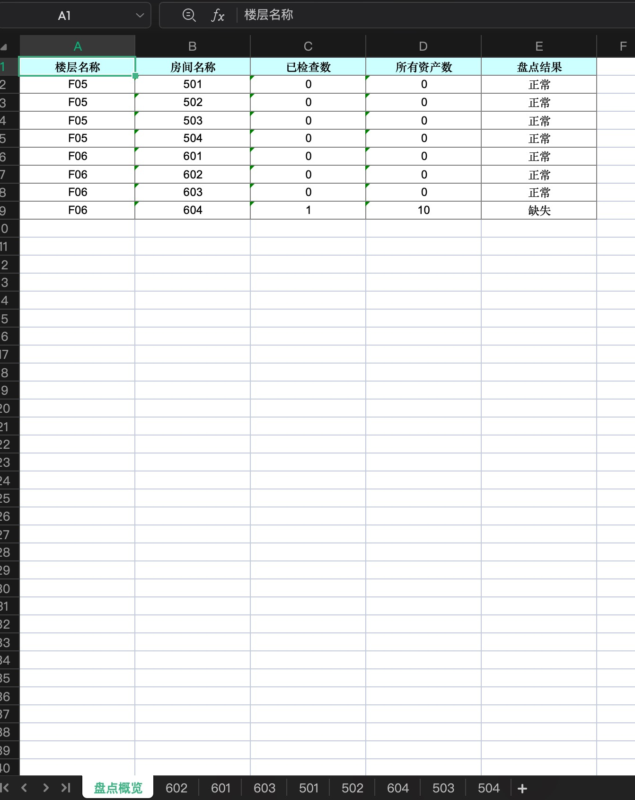
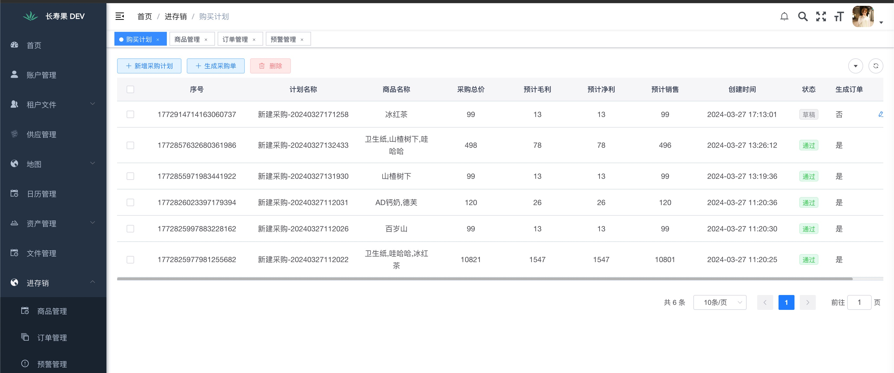
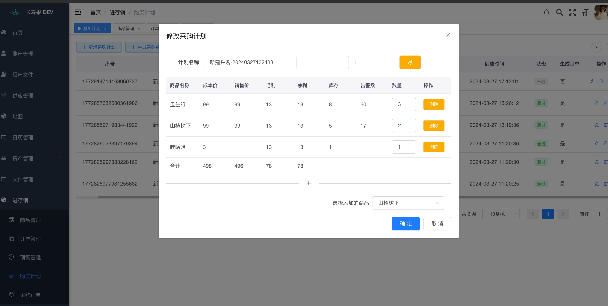
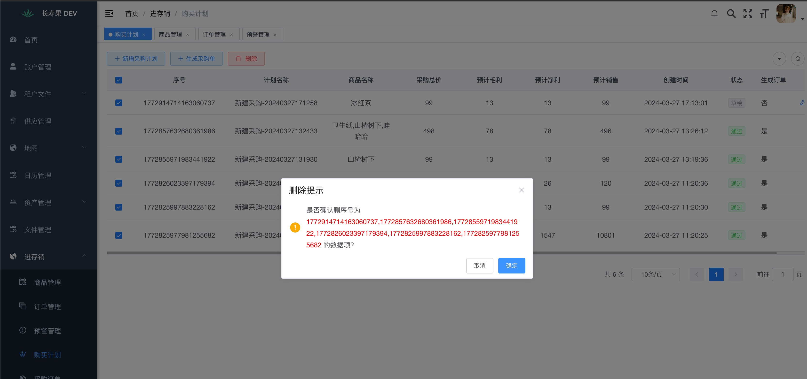

# 功能流程图

## 盘点

## 进存销

## 购买流程

# 功能点一览

❌: 不实现
⌛️: 后期实现
✅: 已实现

|   模块    | 列表 | 增加 | 删除 | 修改 | 详情 | 其他              | 需求                  |
|:-------:|----|----|----|----|----|:----------------|---------------------|
|  用户管理   | ✅  | ✅  | ✅  | ✅  | ✅  | 登录,登出           |                     |
|  租户管理   | ✅  | ✅  | ✅  | ✅  | ✅  |                 |                     |
|  工厂管理   | ✅  | ✅  | ✅  | ✅  | ✅  |                 |                     |
|  楼层管理   | ✅  | ✅  | ✅  | ✅  | ✅  | 批量创建            |                     |
|  房间管理   | ✅  | ✅  | ✅  | ✅  | ✅  | 批量创建            |                     |
|  资产管理   | ✅  | ✅  | ✅  | ✅  | ✅  | 资产禁用,批量创建,生成二维码 | 增加资产使用人             |
|  盘点管理   | ✅  | ✅  | ✅  | ✅  | ✅  | 扫码盘点,下载         | 盘点快照                |
|  H3接口   | ❌  | ❌  | ❌  | ❌  | ❌  | H3 API接口已接入     |                     |
|  文件管理   | ✅  | ✅  | ✅  |    | ✅  |                 |                     |
|  商品管理   | ✅  | ✅  | ✅  | ✅  |    | 生成条形码,库存预警      | 每日盘点,销售数据,库存数据,库存预警 |
|  订单管理   | ✅  | ✅  | ❌  | ❌  | ✅  |                 |                     |
|  财务管理   | ⌛️ | ⌛️ | ⌛️ | ⌛️ | ⌛️ |                 | 收支统计,财务分析,财务报告      |
|  供应商管理  | ✅  | ✅  | ✅  | ✅  | ✅  |                 |                     |
|  采购计划   | ✅  | ✅  | ✅  | ✅  | ✅  |                 |                     |
|  采购订单   | ✅  | ✅  | ❌  | ❌  |    | 驳回              | 发送采购列表              |
|  入库管理   | ⌛️ | ⌛️ | ⌛️ | ⌛️ | ⌛️ |                 |                     |
| 动态表头(后) | ✅  | ✅  | ✅  | ✅  | ❌  |                 |                     |
|  消息中心   | ✅  | ❌  | ❌  | ❌  | ✅  |                 | 标记已读                |

# 技术栈

## 后端

| 组建名称              | 依赖版本         | 说明                 |
|-------------------|--------------|--------------------|
| JDK               | jdk 17       | Jdk最低版本            |
| Spring Boot       | 3.2.0        | springboot版本       |
| mybatis-plus      | 3.5.3.1      | mybatisplus版本      |
| mybatis-plus-join | 1.4.8.1      | mybatisplus-join版本 |
| sqlite-jdbc       | 3.45.1.0     | sqlite驱动版本         |
| lombok            | 1.18.22      | lombok版本           |
| uber-h3           | 4.1.1        | 经纬度转code码          |
| hutool            | 5.8.0        | 常用工具库              |
| org.kie           | 7.14.0.Final | 规则引擎               |
| fastjson2         | 2.0.46       | fastjson2版本        |

# 数据库

| 组建名称        | 依赖版本     | 说明         |
|-------------|----------|------------|
| sqlite-jdbc | 3.45.1.0 | sqlite驱动版本 |
| h2          | 2.2.224  | h2驱动版本     |

## 前端

| 组建名称           | 依赖版本    | 说明                  |
|----------------|---------|---------------------|
| ruoyi          | 3.8.6   | vue版本               |
| qrcodejs       | 1.0.0   | 条形码生成               |
| qrcodejs2      | 0.0.2   | 二维码生成,必须在https下才能使用 |
| @zxing/library | ^0.20.0 | 二维码扫描               |

# 页面展示

## 登录页面

## 用户管理

## 工厂管理

## 楼层管理

## 楼层批量添加

## 房间管理

## 房间批量添加

## 资产管理

## 资产二维码

## 资产批量添加

## 盘点管理

## 盘点概况

## 房间内盘点详情

## 扫码盘点

## 盘点下载

## 品牌管理

## 文件管理

## 商品管理

## 订单管理(商品)

## 预警管理

## 采购计划

## 采购订单

  

