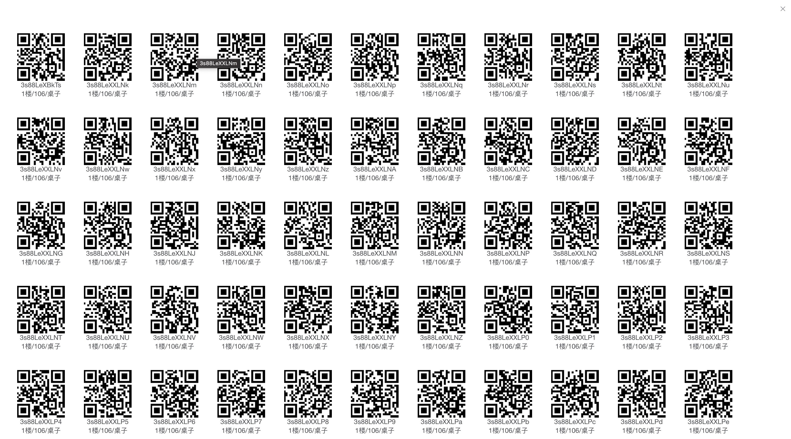

# 功能点

## 用户管理
- [X] 用户注册
- [X] 用户列表
- [X] 登录
- [X] 登出
- [X] 重置密码
 
## 租户管理

- [X] 租户列表
- [X] 租户详情
- [X] 租户创建
- [X] 租户更新
- [X] 租户删除
- [X] 租户详情

## 工厂管理
- [X] 工厂列表
- [X] 工厂创建
- [X] 工厂更新
- [X] 工厂删除
- [X] 工厂详情

## 楼层管理

- [X] 楼层列表
- [X] 楼层创建
- [X] 楼层更新
- [X] 楼层删除
- [X] 楼层详情 

## 楼层管理

- [X] 楼层列表
- [X] 楼层创建
- [X] 楼层更新
- [X] 楼层删除
- [X] 楼层详情
- [X] 楼层批量创建

## 房间管理
- [X] 房间列表
- [X] 房间创建
- [X] 房间更新
- [X] 房间删除
- [X] 房间详情
- [X] 房间批量创建

## 资产管理
- [X] 资产列表
- [X] 资产创建
- [X] 资产批量创建
- [X] 资产更新
- [X] 资产详情
- [X] 资产删除
- [X] 资产禁用
- [ ] 资产使用人
- 

## 盘点管理
- [x] 盘点列表
- [X] 盘点创建
- [X] 盘点更新
- [X] 盘点详情
  - [X] 支持房间全局统计, 房间资产统计,设备禁用
- [X] 盘点删除
- [X] 扫码盘点
  - [x] 禁用资产不可盘点,N秒内重扫资产改为启用
- [ ] 盘点快照
  - [ ] 生成快照后,该盘点失效
- [ ] 盘点信息下载
  - [ ] 支持下载总计与详情
  
## Uber-H3管理
- [X] H3接口
  - [X] api 接口已全部接入

# 技术栈

## 后端

| 组建名称              | 依赖版本         | 说明                 |
|-------------------|--------------|--------------------|
| JDK               | jdk 17       | Jdk最低版本            |
| Spring Boot       | 3.2.0        | springboot版本       |
| mybatis-plus      | 3.5.3.1      | mybatisplus版本      |
| mybatis-plus-join | 1.4.8.1      | mybatisplus-join版本 |
| sqlite-jdbc       | 3.45.1.0     | sqlite驱动版本         |
| lombok            | 1.18.22      | lombok版本           |
| uber-h3           | 4.1.1        | 经纬度转code码          |
| hutool            | 5.8.0        | 常用工具库              |
| org.kie           | 7.14.0.Final | 规则引擎               |
| fastjson2         | 2.0.46       | fastjson2版本        |

 
# 数据库

| 组建名称        | 依赖版本     | 说明         |
|-------------|----------|------------|
| sqlite-jdbc | 3.45.1.0 | sqlite驱动版本 |
| h2          | 2.2.224  | h2驱动版本     |

## 前端

| 组建名称           | 依赖版本    | 说明                  |
|----------------|---------|---------------------| 
| ruoyi          | 3.8.6   | vue版本               |
| qrcodejs       | 1.0.0   | 条形码生成               |
| qrcodejs2      | 0.0.2   | 二维码生成,必须在https下才能使用 |
| @zxing/library | ^0.20.0 | 二维码扫描               |

# TODO:

- [X]  待实现
- [ ] 角色管理
- [ ] 菜单管理
- [ ] 产品管理
- [ ] 订单管理
- [ ] 销售报表
- [ ] 产品购买
- [ ] 利润管理
- [ ] 页面校验
- [ ] 工作流接入
- [ ] 第三方接入
- [ ] 消息中心
- [ ] 

# 页面展示

## 登录页面

## 用户管理

## 工厂管理

## 楼层管理

## 楼层批量添加

## 房间管理

## 房间批量添加

## 资产管理

## 资产二维码

## 资产批量添加

## 盘点管理

## 盘点概况

## 房间内盘点详情

## 扫码盘点

