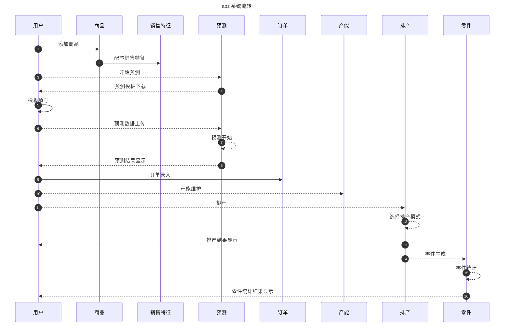

[返回](../../README.md)

```mermaid
sequenceDiagram 
autonumber
title: aps 系统流转
participant U as 用户
participant G as 商品
participant SG as 销售特征
participant F as 预测
participant O as  订单
participant CN as  产能
participant P as  排产
participant PART as  零件

U->>G: 添加商品
G->>SG: 配置销售特征
U-->>F: 开始预测
F-->>U: 预测模板下载
U->>U: 模板填写
U-->>F: 预测数据上传
F-->>F: 预测开始
F-->>U: 预测结果显示
U->>O: 订单录入 
U-->>CN: 产能维护
U-->>P: 排产
P-->>P: 选择排产模式
P-->>U: 排产结果显示
P-->>PART: 零件生成
PART-->>PART: 零件统计
PART-->>U: 零件统计结果显示
``` 

[返回](../../README.md)
