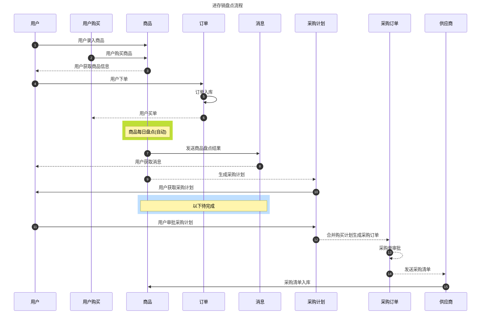
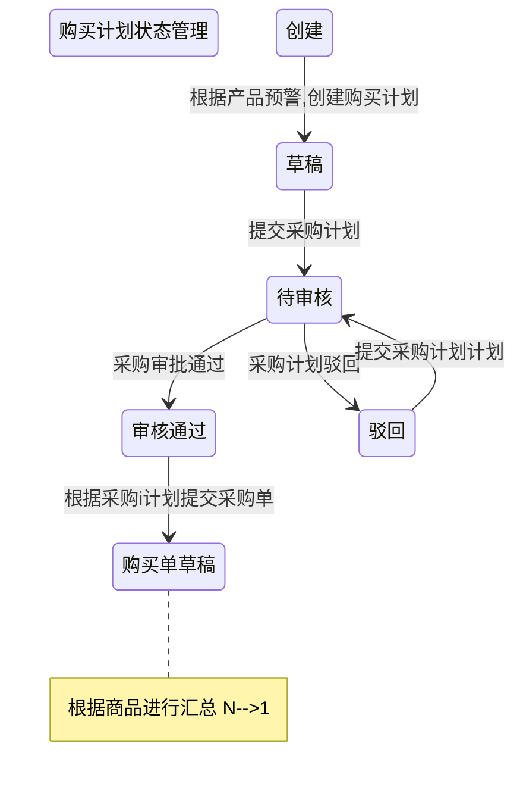
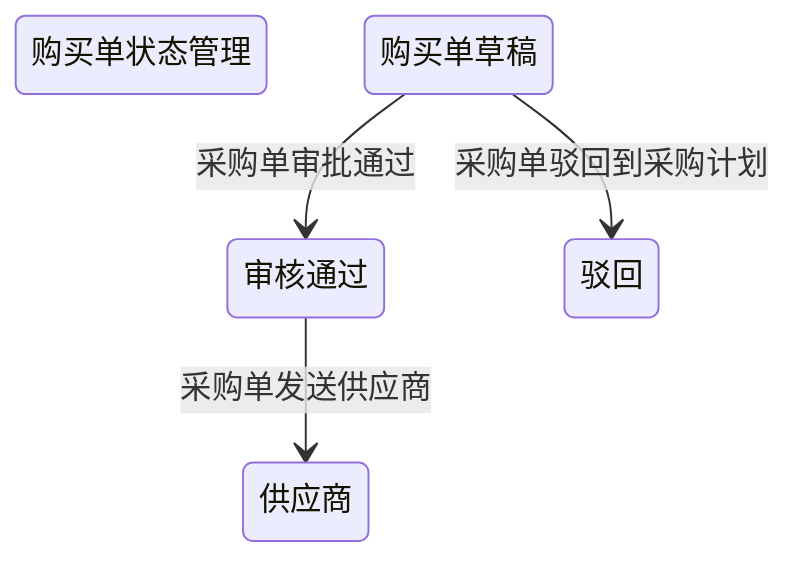

[返回](../../README.md)

```mermaid
sequenceDiagram
autonumber
title: 进存销盘点流程
participant U as 用户
participant BU as 用户购买
participant G as 商品
participant O as  订单
participant M as  消息
participant BB as  采购计划
participant BO as  采购订单
participant S as   供应商


U->>G: 用户录入商品
BU->>G: 用户购买商品
G-->>U: 用户获取商品信息
U->>O: 用户下单
O->>O: 订单入库
O-->>BU: 用户买单
rect rgb(191, 223, 55)
Note over G: 商品每日盘点(自动)
end
G->>M: 发送商品盘点结果
M-->>U: 用户获取消息
G-->>BB: 生成采购计划
BB->>U: 用户获取采购计划
rect rgb(191, 223, 255)
Note over G,M:  以下待完成
end 
U->>BB: 用户审批采购计划
BB-->>BO: 合并购买计划生成采购订单
BO-->>BO: 采购单审批
BO-->>S : 发送采购清单
S->>G: 采购清单入库
```

## 购买流程

```mermaid
stateDiagram-v2
title: 购买计划状态管理
创建--> 草稿:  根据产品预警,创建购买计划
草稿 --> 待审核: 提交采购计划
待审核 --> 审核通过: 采购审批通过
待审核 --> 驳回: 采购计划驳回
驳回 -->待审核: 提交采购计划计划

审核通过--> 购买单草稿: 根据采购i计划提交采购单 
note right of 购买单草稿: 根据商品进行汇总 N-->1
```

---

```mermaid
stateDiagram-v2
title: 购买单状态管理
购买单草稿 --> 审核通过: 采购单审批通过
购买单草稿 --> 驳回: 采购单驳回到采购计划
审核通过 --> 供应商: 采购单发送供应商
```

[返回](../../README.md)

