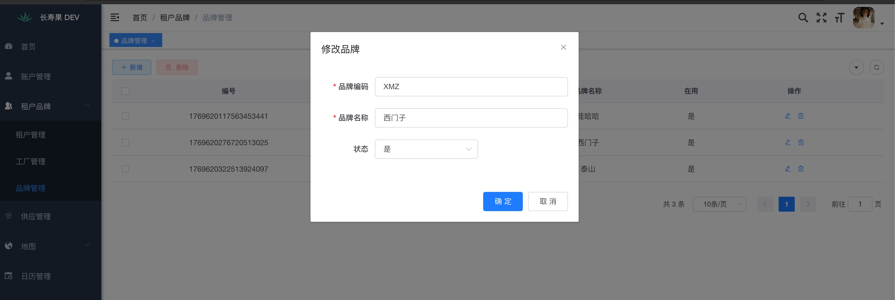
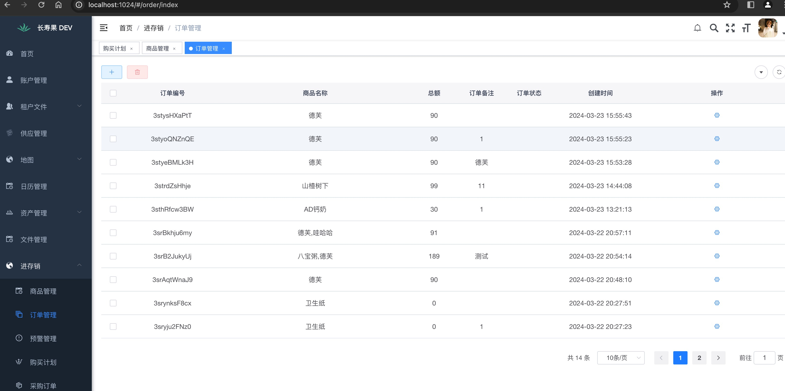
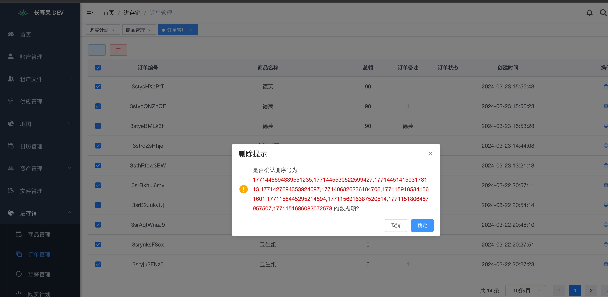
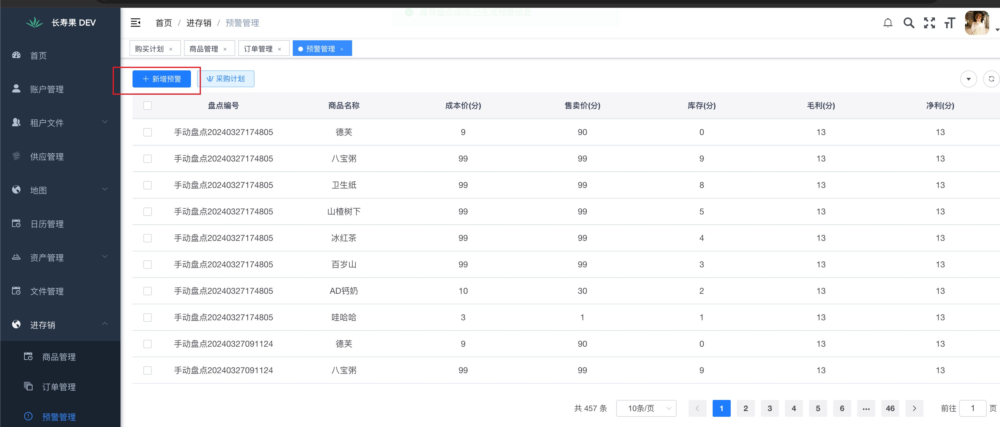

## 登录页面

## 用户管理

## 工厂管理

## 楼层管理

## 楼层批量添加

## 房间管理

## 房间批量添加

## 资产管理

## 资产二维码

## 资产批量添加

## 盘点管理

## 盘点概况

## 房间内盘点详情

## 扫码盘点

## 盘点下载

## 品牌管理

## 文件管理

## 商品管理

## 订单管理(商品)

## 预警管理

## 采购计划

## 采购订单

